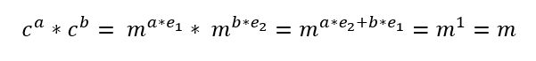

## Двоечница

| Событие | Название | Категория | Сложность |
| :------ | ---- | ---- | ---- |
| VKACTF kids 2023 | Двоечница  | Crypto | Средняя |

## Описание

>Автор: Inssurg3nt
>
>Описание: В школе наконец-то поставили шифровальный аппарат для безопасного обмена информацией сразу в двух вариантах! Но отличник Ваня, недавно изучивший основы алгебры сразу понял,  что к чему.

# Решение

Из анализа исходников делаем несколько вывод, что, сообщение шифруется при двух разных экспонентах. При чем можно заметить, что они всегда взаимно просты, а значит, к ним применим расширеный алгоритм Евклида в виде:


А значит исходное сообщение может быть найдено по следующей формуле:


Получаем флаг!

[Решение](solve.py)
### Флаг

Получаем наш флаг
```
vka{RSA_v5_4lg3br4!!!}
```