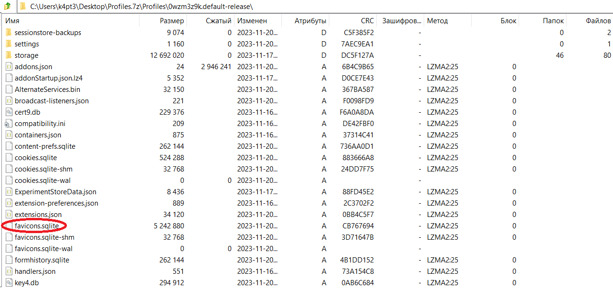
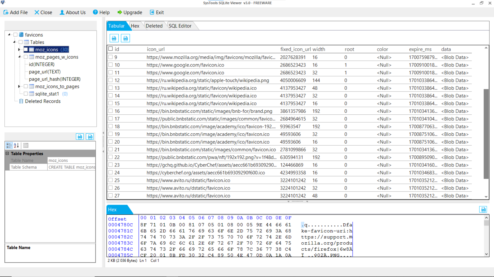
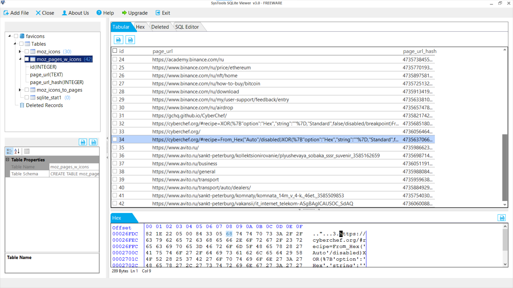
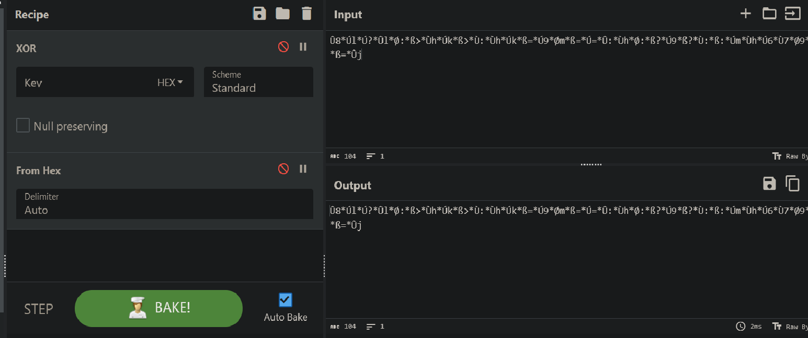
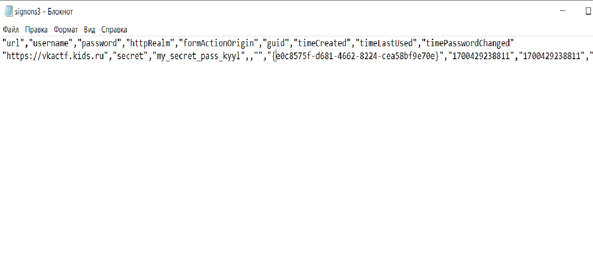

# Важные советы

| Cобытие       | Название       | Категория | Сложность |
|:-------------:|:-------------: |:---------:|:---------:|
| VKAСTF Kids 2023 | Важные советы | Forensics | Средняя |

## Описание

>Автор [0xR1st0]
>
>Наш преподаватель по информатике всегда говорил нам о важности удаления после себя сессии браузера, но однажды я нашел неочищенный компьютер. Что же он скрывает....?
 

## Решение

Вам дана корневая директория Firefox.
Для начала нам надо определить, где хранится история браузера.



Нас интересует файл favicons.sqlite, где хранится вся история.
Для просмотра содержимого можно воспользоваться приложением sqlite-viewer.



После небольшого изучения натыкаемся на ссылки, ведущие на cyberchef.



Открыв cyberchef, мы видим шифротекст и операцию XOR без ключа.



Можно предположить, что ключём к шифру может являться пароль учётной записи.
Пароли хранятся в файле signons3.txt.



Применяем пароль как ключ для нашего шифра и получаем флаг.

### Флаг
```
vka{D0_n0T_n3gL3ct_D1g1T4l_hYG13n3}
```
