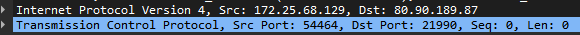
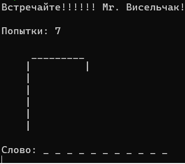
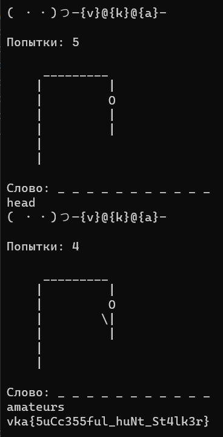

# Палач

| Cобытие       | Название       | Категория | Сложность |
|:-------------:|:-------------: |:---------:|:---------:|
| VKAСTF Kids 2023 | Палач | Forensics | Средняя |

## Описание

>Автор [0xR1st0]
>
> "Столько играл, но так и не понял суть игры :( 
>  
>  Теперь ещё и игра где-то потерялась :(" 


# Решение

В данном задании нам предоставлен дамп трафика, значит открываем wireshark и начинаем анализировать.
В трафике видно, что идёт общение с пользователем по ip 172.25.68.129 и сервисом ip которого 80.90.189.87.



Исходя из изученного трафка можно сделать вывод, что общение проходит по netcat с сервисом 80.90.189.87:21990
Попробуем к нему подключиться 



Интересная игра, но выйграть в ней так просто не выходит.
Попробуем воспроизвести действия из трафика.
Самым интересным являемся момент когда получают vka{##########}



### Флаг
```
vka{SuccS33ful_Hunt_St4lk3r}
```
