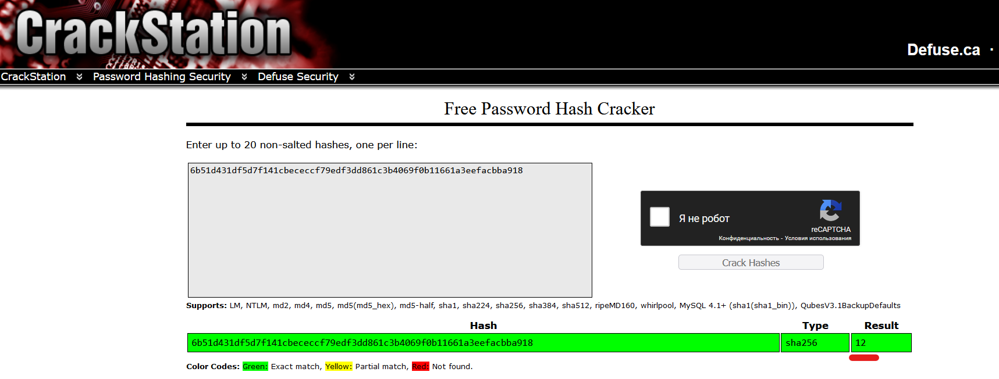

# Captcha_v2.0

| Cобытие       | Название       | Категория | Сложность |
|:-------------:|:-------------: |:---------:|:---------:|
| VKAСTF Kids 2023 | captcha_v2.0| MISC | Сложная |

## Описание

>Автор [old3gg]
>
>Надеюсь вас не слишком утомила разминка,в виде решения первой капчи. Теперь можете оценить её улучшенную весрию.

# Решение
По опыту приедыдущего задания сразу понимаем, что без автоматизации здесь не обойтись, и в тот раз нам также нужно набрать 1337 очков ,для получения флага.
Итак, самая большая проблема - это автоматизация распознования голоса на аудиозапсии. Существует множество подходов к решению, но я использовал библиотеку питоновскую `speech_recognition`. В процесе неё понимаем что распозование - дело не быстрое и на каждое 10-секундное аудио уходит по 4-5 секунд.
Тут же обращаем внимение на названия аудиозаписей `http://127.0.0.1:3336/static/audio_6b51d431df5d7f141cbececcf79edf3dd861c3b4069f0b11661a3eefacbba918.wav` , похоже на формат `audio_`+что-то похожее на хэш, сходу пробуем подобрать любой из них:



Можем сделать предоположение, что это номер хэша, и их в /static лежит ограниченное количество. Автоматизируя процесс взятия хэш-суммы аудиофайлов со страницы - понимаем что их всего 40.
Теперь хорошо бы иметь статичный файл типа словаря, чтобы распознать все аудио 1 раз, а потом уже брать готовые значения ответов. Для этого воспользуемся библиотекой `pickle` и напишем промежуточный скрипт.

[промежуточный скрипт](../exploit/recognition.py)

P.S. иногда `speech_recognition` допускает ошибки на выходе, но, к счастью, формат у аудио одинаковый, поэтому ручками подкорректируем выходной словарь.

Отлично, теперь имея словарь имён аудио и их значений `results.pickle` не составляет турда написать конечный сплйот:


[Сплойт автора](../exploit/splo.py)

### Флаг
```
vka{now_you_are_really_captha_master}
```
