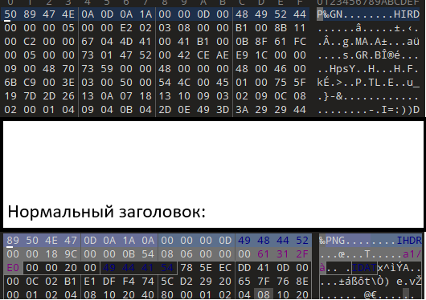
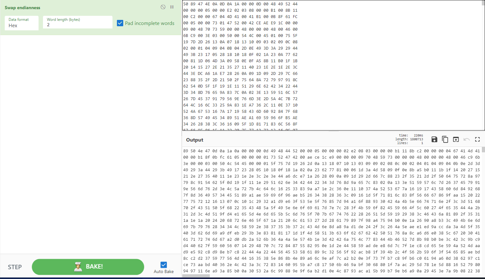
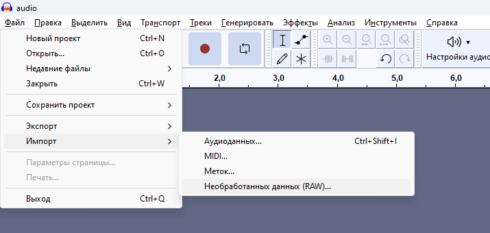
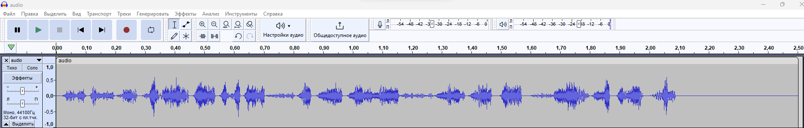
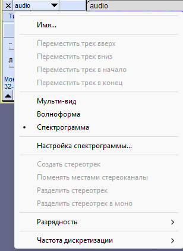
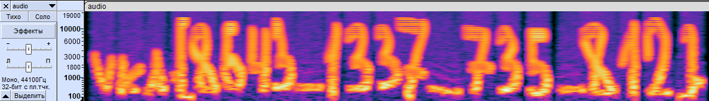

# Players Club

| Cобытие       | Название       | Категория | Сложность |
|:-------------:|:-------------: |:---------:|:---------:|
| VKAСTF Kids 2023 | Players Club | MISC | Сложная |

## Описание

>Автор [b3rcut7]
>
>По-моему мы ВСЁ ПЕРЕПУТАЛИ и запустили вирус шифровальщик у себя...Я упаковал его в архив, но не помню пароля, вроде немного цифр...
>

# Решение

Архив запаролен. Что ж, взломаем!

```bash
zip2john players_club.zip > hash.txt;

john --fork=12 --mask='?d' --min-length=1 --max-length=6 ./hash.txt;

john --show ./hash.txt;

```

Пароль: 812735

Обращаем внимание на название файла: "lpyar_slcbup.gn" поменяем местами каждые 2 байта:

lp -> pl

ya -> ay

.   .   .

lpyar_slcbup.gn -> players_club.png

Это как раз намёк, на измененную последовательность байтов внутри файла:



Воспользуемся cyberchef:


Теперь наш заголовок верен, продолжим исследовать файл:

Сохраняем и открываем в довичном редакторе. Листаем ниже, видим что файл подозрительно большой... Пробуем найти конец картинки:


Видим, что дальше лежат еще байты в странном сыром виде... Можем предположить, что это либо картинка raw, либо raw аудиозапись.Достанем их и сохраним в отдельный файл. Проверим оба варианта и поймем, что это всё таки аудио:



Получаем нечто неприятное для наших ушей:



Однако стоит лишь нам открыть спектрограмму, как мы получим нечто приятное для наших глаз:





### Флаг
```
vka{8643_1337_735_812}
```
