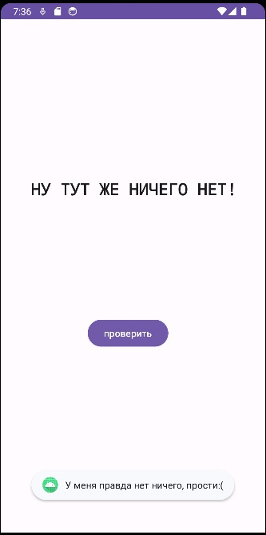
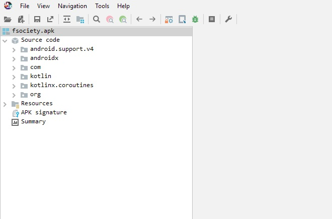
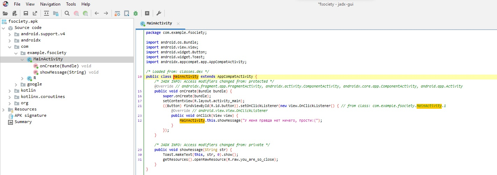

# Mobile

|   Cобытие   | Название | Категория | Сложность |
| :---------: | :------: | :-------: | :-------: |
| VKACTF Kids 2023 |  Mobile |  Reverse engineering  |  Средняя  |

## Описание

>Автор: b3rcut7
>
>Когда я сделаю это...Телефон каждого в этом здании станет моим. 'Доступ уровня Бог', помнишь?
>

# Решение

Запускаем приложение:



Необходимо скачать приложение для обратной разработки приложений .apk

Я для этого использую JADX



Структура приложения стандартная:



Анализируем код, понимаем,что приложение действительно не делает ничего, однако есть интересная функция:
```java
    public void showMessage(String str) {
        Toast.makeText(this, str, 0).show();
        getResources().openRawResource(R.raw.you_are_so_close);
    }
}
```

Данная функция подгружает какой-то файл you_are_so_close из raw ресурсов.
Найдем этот файл в /Resources/res/raw/you_are_so_close.rar

Чтобы достать его воспользуемся утилитой apktool:
```bash
apktool d fsociety.apk
```

Переходим в ту же папку, распаковываем архив и видим 2 файла:

1.Исходный код программы(Можно начать его изучение и понять как формируется флаг)

2.Исполняемый файл(Его можно попросту запустить и он выведет флаг!)

### Флаг


```
vka{0k_y0U_4RE_R34llY_N1ce_4NDR01D_XAKEP_!_kEEp_w0RK1ng_I_bel1EVe_in_Y0u!}
```
