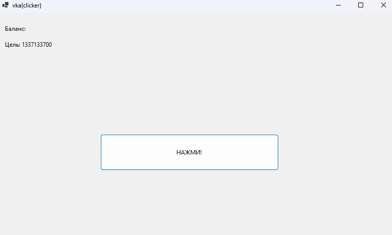
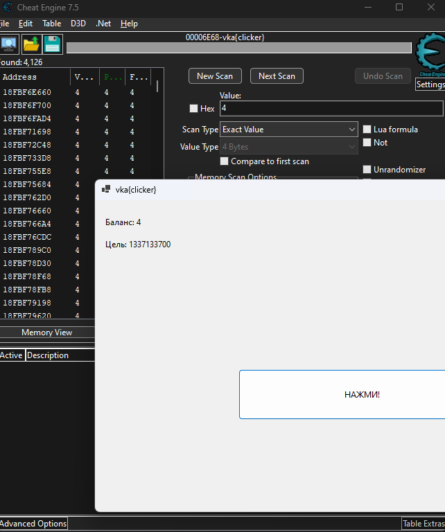
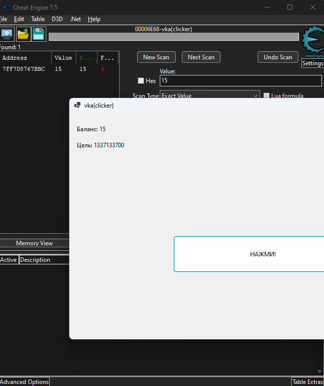
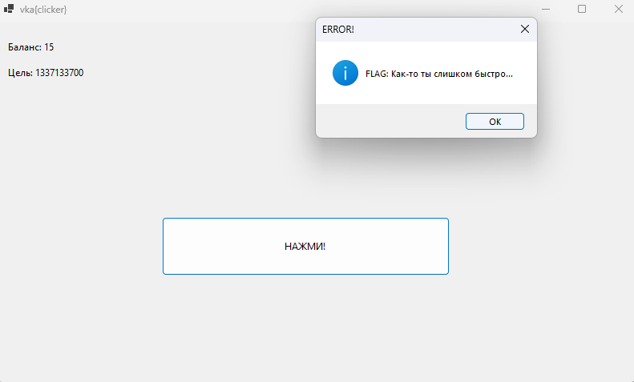
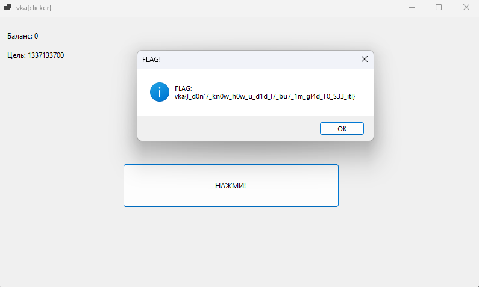
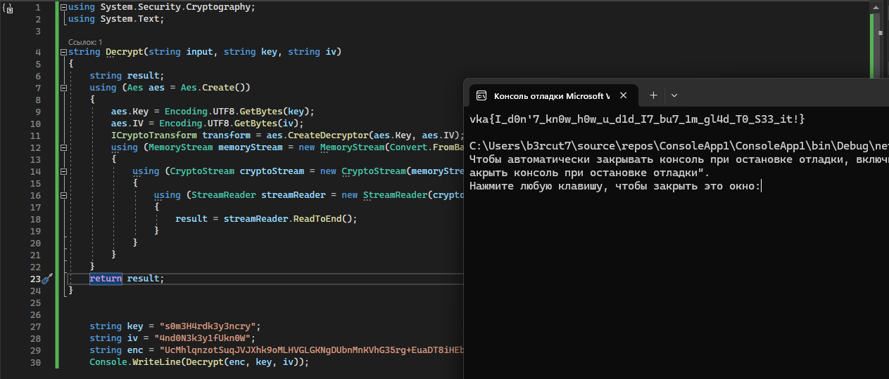

## Clicker

| Событие | Название | Категория | Сложность |
| :------ | ---- | ---- | ---- |
| VKACTF kids 2023 | Clicker | Reverse engineering | Сложная |

  
### Описание


> Автор: [b3rcut7]
>
> Копаясь на компе одного из сотрудников безопасности FSociety, ты нашёл интересный архив Desktop/Security/Tools/clicker.zip.
>
> По-моему это не просто игрушка...
>


### Решение

Запускаем файл и сразу понимаем, что вручную решать данное задание крайне сложно...

Тогда у нас есть 3 варианта:

1)Написать кликер(не лучшее решение)

2)Обратная разработка(хорошее решение)

3)Подмена памяти


Начнем с третьего варианта:
## Первое решение


Воспользуемся программой для замены данных в памяти, например, Cheat Engine:

1. Пару раз нажимаем на кнопку для инициализации переменных

2. Находим наше первоначальное значение в Cheat Engine



3. Еще несколько раз жмем на кнопку, чтобы отсеить значения

4. Отсеиваем значения, указав новое



5. Дважды жмём по нему в панели значений

6. Внизу, в таблице выбранных значений, пробуем подменить его на необходимое нам

7. Снова жмём на кнопку и получаем результат:



8. Количество нажатий вряд ли отрицательное число, попробуем зайти с другой стороны и заменить значение на **-1**

9. Получаем флаг!




## Второе решение

Попробуем отреверсить наше приложение, для этого воспользуемся программой dnSpy:

Поскольку приложение написано на языке C#, оно всю логику оно хранит в файле динамически подключаемой библиотеки(DLL).

Откроем exe и dll сразу. 


Попробуем понять логику программы. Для этого откроем clicker.dll ->{} clicker ->Form1:

Видим интересующие нас функции:

[dnspy2](dnspy2.png)

Вникаем в логику программы и понимаем что функция Decrypt расшифровывает сообщение secureString, зашифрованное AES, с помощью key и iv.

Функция дешифровки у нас уже есть, просто перепишем код и подставим данные:



Получаем флаг!


### Флаг

```
vka{I_d0n'7_kn0w_h0w_u_d1d_I7_bu7_1m_gl4d_T0_S33_it!}
```
