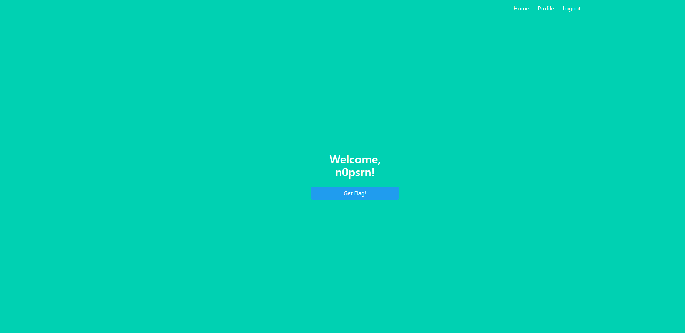
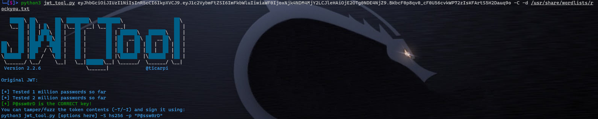
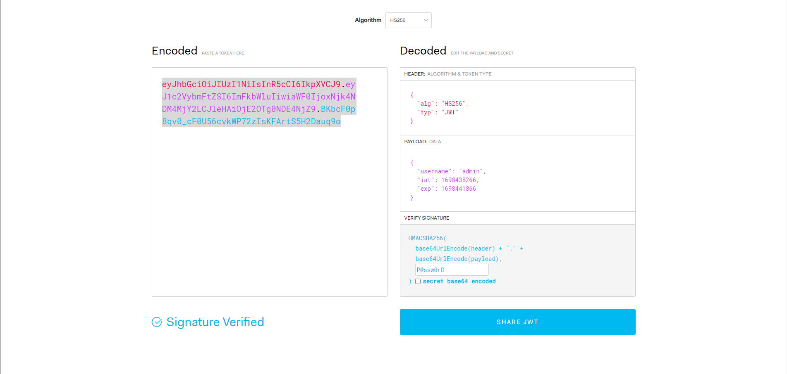
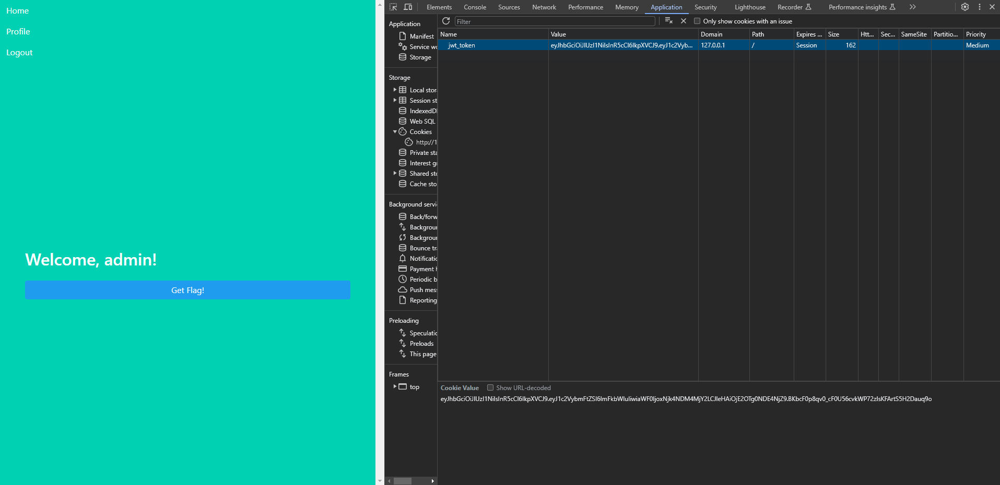
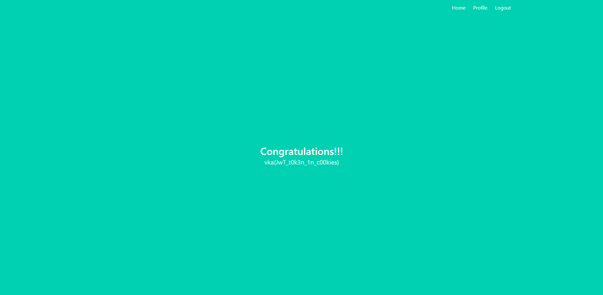

# Breakfast

|   Cобытие   | Название | Категория | Сложность |
| :---------: | :------: | :-------: | :-------: |
| VKACTF Kids 2023 |  Breakfast |  Web  |  Легко  |

## Описание

>Автор: n0psrn
>
>Любишь печенье на завтрак? Если нет, то может быть попробуешь с молоком.

# Решение

Нам дан url адрес, перейдя на который нас встречаешь дружелюбный пользовательский интерфейс. Пользователь может зарегистрироваться, войти в систему и попытаться получить флаг.



Как оказалось получить флаг может только admin, чтож посмотрим что можно с этим сделать.

При авторизации на сайте в сессии пользователя устанавливается кука. Изучив её, можно понять что это jwt token, но исходных кодов у нас нет и получить secret_key так легко не получиться.

Поискав на просторах интернета различные варианты "борьбы" с jwt, в глаза бросается интересный способ с перебором secret_key под имеюющуюся у нас куку.

Для этого воспользовавшись любым удобным скриптом (jwttool, hashcat), перебираем куку по стандартному словарю "rockyou", и спустя пару секунд получаем долгожданный secret_key = "P@ssw0rD"



Теперь нам остается только переподписать имеюющуюся куку на "username:admin" и заменить её любым удобным способом (например в браузере)




Ура!!! Жмем заветную кнопку и получаем флаг! Вкусно!




### Флаг


```
vka{JwT_t0k3n_1n_c00kies}
```
