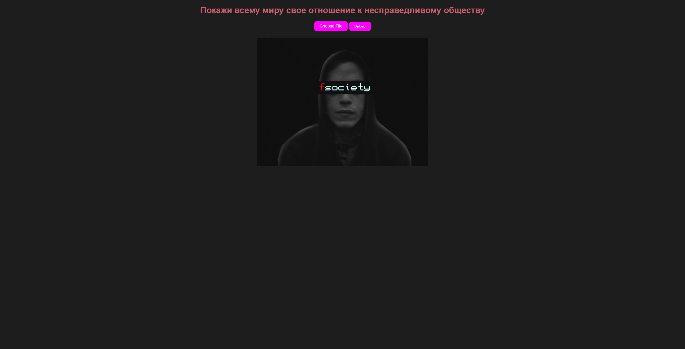
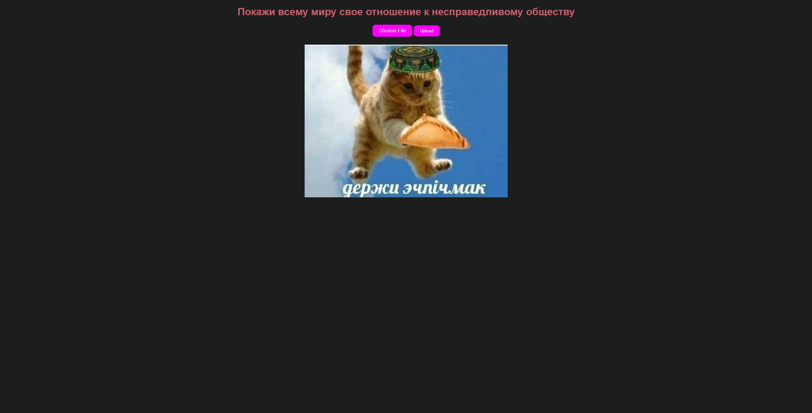
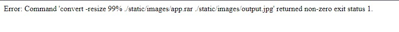
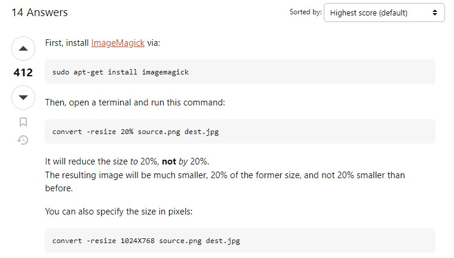
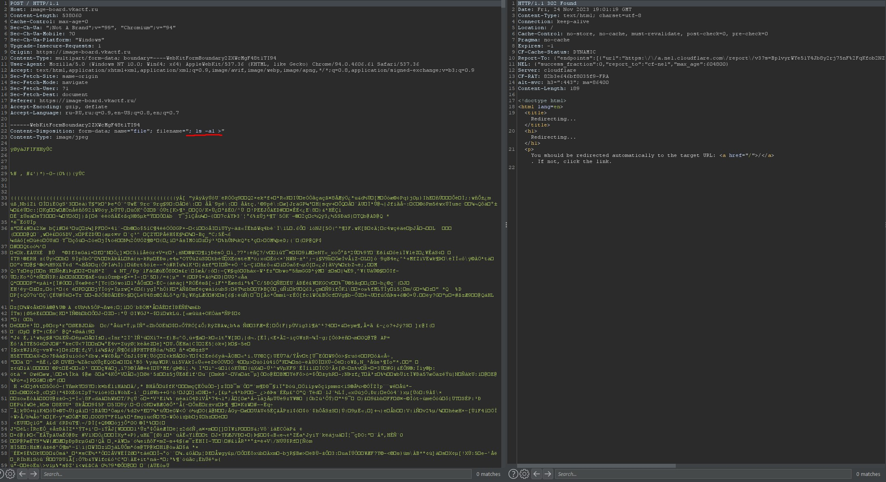
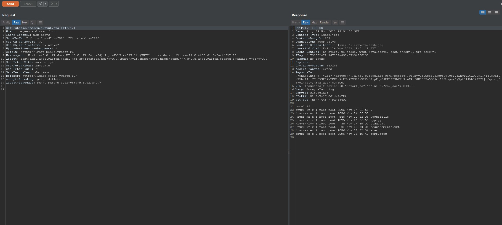
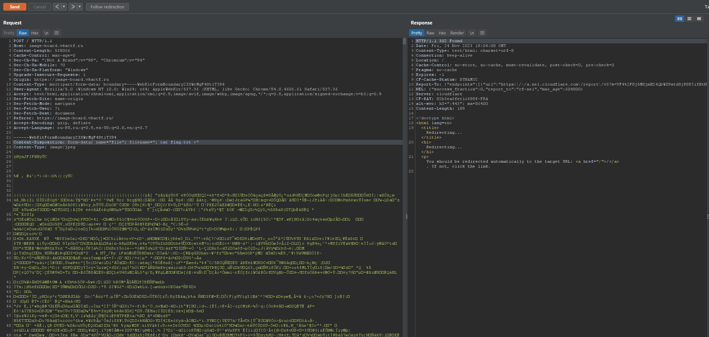
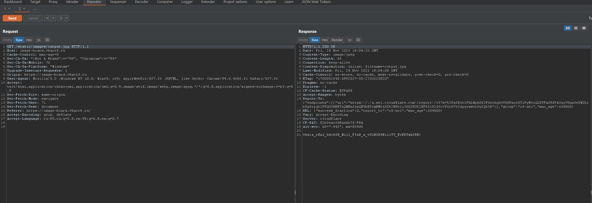

## Image sharing

| Событие | Название | Категория | Сложность |
| :------ | ---- | ---- | ---- |
| VKACTF kids 2022 | Image sharing  | Web | Hard |

  
### Описание


> Автор: [ Po4est ]
>
> Недавно хакеркая группировка Fsociety опубликовала [сайт](https://image-board.vkactf.ru), чтобы каждый мог загрузить туда свое фото, и показать всему миру свое отношение к несправедливости современного общества.


### Решение

После перехода на задание, мы видим сайт с простым функционалом, а именно возможностью загружать фотографии.


Можем попытаться загрузить вилидную фотографию и увидим, что она загрузилась успешно


Теперь попробуем загрузить файл, который может привести к неправильному отображению фото. 
Я возьму архив app.rar и попробую его загрузить.
При попытке загрузить архив получим следующую ошибку (это работает не только для архивов, но и для любого другого типа файла не относящегося к изображению).


Если поискать в интернете комманду в которой произошла ошибка, становится понятно, что это Linux команда для изменения размера фотографии. Также видно что имя файла, который мы загружаем, подставляется в команду без какой-либо фильтрации. Это значит что данный сайт уязвим к OS injection через имя загружаемого файла.


Поняв что наше имя файла подставляется в первый аргумент команды ```convert -resize 99% ./static/images/{} ./static/images/output.jpg```, можем использовать следующую нагрузку ```; ls -al >```. Данная нагрузка завершит выполнение команды ```convert```. Затем выполнит команду ```ls -al``` и запишет вывод этой команды в файл ```./static/images/output.jpg```. После этих действий можно выкачать фото перейдя по ссылке https://image-board.vkactf.ru/static/images/output.jpg, либо посмотрев слдержимое через Burp Suite
  

Посмотрев содержимое директории, видим ```flag.txt```. С помощью нагрузки ```cat flag.txt >``` читаем его, и получаем наш флаг.
  

### Unintended решение от пользователя KingOfDice

1) создаем файл *.svg

2) пишем в него

```
<?xml version="1.0" encoding="UTF-8"?>
    <svg width="1200px" height="1200px">
        <image width="1200" height="1200" href="text:flag.txt" />
    </svg>
```

3) идем по [ручке](https://image-board.vkactf.ru/static/images/output.jpg) и видим флаг в картинке

Почитать про эту уязвимость: https://imagetragick.com/

### Флаг

```
vka{a_real_hacker_will_find_a_vulnerability_everywhere}
```
